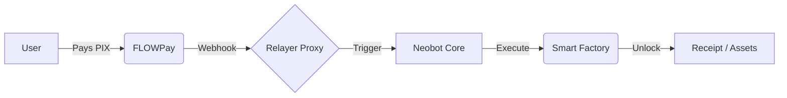

# 🚀 FLOWPay - Pix-First Payment Gateway for Web3

```text
========================================
             F L O W P A Y
========================================
 PIX-FIRST PAYMENT GATEWAY FOR WEB3
     Access first. Settle later.
========================================
Status: v2.0.0 [SOBERANIA]
Audit: JAN/2026 (NΞØ Protocol)
Stack: Astro + SQLite + Node (Railway)
========================================
```

## ▓▓▓ MISSION

────────────────────────────────────────
O FLOWPay é um gateway de pagamento focado em Pix e Web3. Projetado para oferecer soberania total e complexidade invisível.

**SOVEREIGN NODE:** Esta versão utiliza persistência local SQLite. No Railway, utilize Volumes em `/app/data`.

## ▓▓▓ CORE PRINCIPLES

────────────────────────────────────────

- └─ Checkout Familiar (PIX/BRL)
- └─ Complexidade Invisível
- └─ Base Soberana (On-chain proof)
- └─ O usuário compra ACESSO.
- └─ O protocolo registra ESTADO.

## ▓▓▓ CAPABILITIES

────────────────────────────────────────

- [####] PIX Dynamic QR ............. OK
- [####] HMAC Secure Webhooks ....... OK
- [####] Assisted Settlement ........ OK
- [####] Real USDT Delivery ......... OK
- [####] Hardened Anti-Fraud ........ OK

## ▓▓▓ ARCH OVERVIEW

────────────────────────────────────────

## ▓▓▓ ARCH OVERVIEW

────────────────────────────────────────



> **Detailed Payment Flow:** [docs/PAYMENT_FLOW.md](./docs/PAYMENT_FLOW.md)


────────────────────────────────────────

### 🔒 SECURITY ARCHITECTURE: RELAYER PROXY

O FLOWPay opera estritamente como um **Relayer Proxy** para o Neobot Smart Factory Core.

- **Non-Custodial Trigger:** Este node *não* armazena chaves privadas de provisionamento. Sua única função é verificar o pagamento local e repassar o comando de "Unlock" via canal autenticado por API Key.
- **Segregated Secrets:** Segredos de infraestrutura e hashes de minting residem exclusivamente no Core da Smart Factory (Neobot).
- **Auditability:** Cada trigger é registrado localmente e pode ser auditado contra os logs da Smart Factory.

TECHNICAL DETAILS: [SETUP.md](./SETUP.md)
────────────────────────────────────────

## ▓▓▓ NΞØ MELLØ

────────────────────────────────────────
Core Architect · NΞØ Protocol
<neo@neoprotocol.space>

"Code is law. Expand until
 chaos becomes protocol."

**Security by design.**
Exploits find no refuge here.

────────────────────────────────────────

```text
░█▀█░█▀▀░█▀█░░░█▀█░█▀▄░█▀█░▀█▀░█▀█░█▀▀░█▀█░█░░
░█░█░█▀▀░█░█░░░█▀▀░█▀▄░█░█░░█░░█░█░█░░░█░█░█░░
░▀░▀░▀▀▀░▀▀▀░░░▀░░░▀░▀░▀▀▀░░▀░░▀▀▀░▀▀▀░▀▀▀░▀▀▀

     █ 
  ▄███  
 █  █ █
 █ █  █
  ███▀  
 █
```
