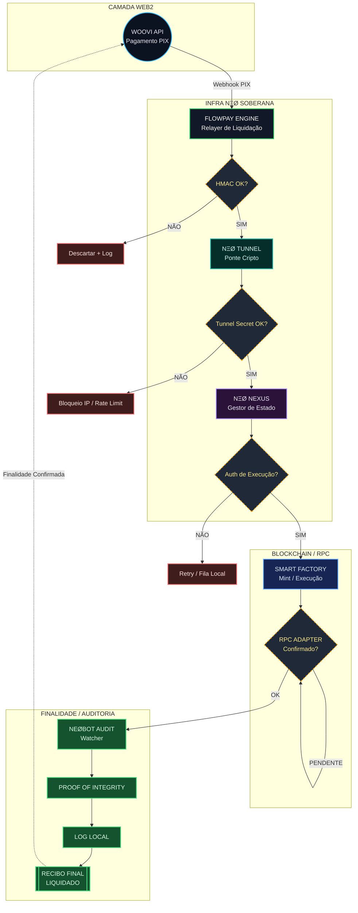

<!-- markdownlint-disable MD003 MD007 MD013 MD022 MD023 MD025 MD029 MD032 MD033 MD034 -->

# FLOWPay: Motor de Liquidação Soberana

```text
========================================
     FlowPay - SETTLEMENT ENGINE
========================================
Nó: mio-flowpay
Protocolo: NΞØ Smart Factory
Infra alvo: Railway + NΞØ Tunnel + Nexus Core
Papel deste README: Arquitetura e contexto
========================================
```

## Visão Arquitetural

O **FlowPay** é o motor de liquidação determinística do ecossistema NΞØ. Ele orquestra a conversão de capital Web2 (PIX/WooVi) em ativos Web3, utilizando uma arquitetura de **Relayer Proxy** isolada para garantir a soberania das chaves privadas.

## Fluxo Operacional (Conceitual)



## Segurança e Conformidade

A segurança do FlowPay é baseada em **Blindagem Tripla**:

1. **Segregação:** O FlowPay não armazena `MINTING_KEYS`. Ele apenas solicita execuções à Factory via canal seguro.
2. **Auditabilidade:** Toda transação é acompanhada por uma **Proof of Integrity (PoI)** assinada pelo Neobot.
3. **Isolamento de Rede:** Comunicação via **NΞØ Tunnel** com handshake de `TUNNEL_SECRET`.

## Estado Atual do Projeto

- Runtime principal em **Astro server mode** com adapter `@astrojs/node`.
- Deploy e operação em **Railway**.
- Endpoints de aplicação padronizados em **`/api/*`**.
- Segurança consolidada com documento canônico em `docs/SECURITY_AUDIT.md`.
- Documento histórico de auditoria mantido em `docs/archive/SECURITY_AUDIT_2026-02-08.md`.

## Fronteiras de Documentação

- Este `README.md` descreve **arquitetura, contexto e direção**.
- Toda configuração técnica, execução local, comandos e deploy ficam em **`SETUP.md`**.

## Índice Canônico

- `SETUP.md` -> Setup técnico, execução e operação.
- `docs/README.md` -> Mapa da base de conhecimento.
- `docs/WOOVI_INTEGRATION_GUIDE.md` -> SSOT de integração PIX/WooVi.
- `docs/SECURITY_AUDIT.md` -> Estado de segurança vigente.

---

NΞØ MELLØ
Core Architect · NΞØ Protocol
