# 🚀 FLOWPay - Pix-First Payment Gateway for Web3

```text
========================================
             F L O W P A Y
========================================
 PIX-FIRST PAYMENT GATEWAY FOR WEB3
     Access first. Settle later.
========================================
Status: v2.2.0 [AUTONOMOUS]
Audit: FEB/2026 (NΞØ Protocol)
Stack: Astro + SQLite + Node (Railway)
========================================
```

## ▓▓▓ MISSION

────────────────────────────────────────
O FLOWPay é um gateway de pagamento focado em Pix e Web3. Projetado para oferecer operação autônoma e complexidade invisível.

**Autonomous NODE:** Esta versão utiliza persistência local SQLite. No Railway, utilize Volumes em `/app/data`.

## ▓▓▓ CORE PRINCIPLES

────────────────────────────────────────

- └─ Checkout Familiar (PIX/BRL)
- └─ Complexidade Invisível
- └─ Base Autônoma (On-chain proof)
- └─ O usuário compra ACESSO.
- └─ O protocolo registra ESTADO.

## ▓▓▓ CAPABILITIES

────────────────────────────────────────

- [####] PIX Dynamic QR ............. OK
- [####] HMAC Secure Webhooks ....... OK
- [####] Administrative Metrics ..... OK
- [####] Real USDT Delivery ......... OK
- [####] Hardened Anti-Fraud ........ OK
- [####] Account Abstraction (AA) ... OK
- [####] Guest Access Tracking ...... OK

## ▓▓▓ ARCH OVERVIEW

────────────────────────────────────────

## ▓▓▓ ARCH OVERVIEW

────────────────────────────────────────



```mermaid
graph TD
    User((Usuário)) -->|Paga PIX| FP[FLOWPay Node]
    
    subgraph "FLOWPay Autonomous"
        FP -->|Webhook| ID{Idempotency}
        ID -->|PoE| PB(Merkle Batching)
        ID -->|Nexus| NB(Nexus Bridge)
        ID -->|Trigger| B[Relayer Proxy]
    end

    subgraph "Neobot Smart Factory"
        B -->|API Auth| NC[Neobot Core]
        NC -->|Mint/Unlock| BC((Blockchain Proof))
    end

    PB -.->|Base L2 Anchor| BC
```

> **Full Architecture & Flows:** [docs/PAYMENT_FLOW.md](./docs/PAYMENT_FLOW.md) | [docs/TECH-SPECS-integration.md](./docs/TECH-SPECS-integration.md) | [docs/ADMIN_METRICS.md](./docs/ADMIN_METRICS.md)


────────────────────────────────────────

### 🔒 SECURITY ARCHITECTURE: RELAYER PROXY

O FLOWPay opera estritamente como um **Relayer Proxy** para o Neobot Smart Factory Core.

- **Non-Custodial Trigger:** Este node *não* armazena chaves privadas de provisionamento. Sua única função é verificar o pagamento local e repassar o comando de "Unlock" via canal autenticado por API Key.
- **Segregated Secrets:** Segredos de infraestrutura e hashes de minting residem exclusivamente no Core da Smart Factory (Neobot).
- **Auditability:** Cada trigger é registrado localmente e pode ser auditado contra os logs da Smart Factory.

TECHNICAL DETAILS: [SETUP.md](./SETUP.md)
────────────────────────────────────────

## ▓▓▓ NΞØ MELLØ

────────────────────────────────────────
Core Architect · NΞØ Protocol
<neo@neoprotocol.space>

"Code is law. Expand until
 chaos becomes protocol."

**Security by design.**
Exploits find no refuge here.

────────────────────────────────────────

```text
░█▀█░█▀▀░█▀█░░░█▀█░█▀▄░█▀█░▀█▀░█▀█░█▀▀░█▀█░█░░
░█░█░█▀▀░█░█░░░█▀▀░█▀▄░█░█░░█░░█░█░█░░░█░█░█░░
░▀░▀░▀▀▀░▀▀▀░░░▀░░░▀░▀░▀▀▀░░▀░░▀▀▀░▀▀▀░▀▀▀░▀▀▀

     █ 
  ▄███  
 █  █ █
 █ █  █
  ███▀  
 █
```
