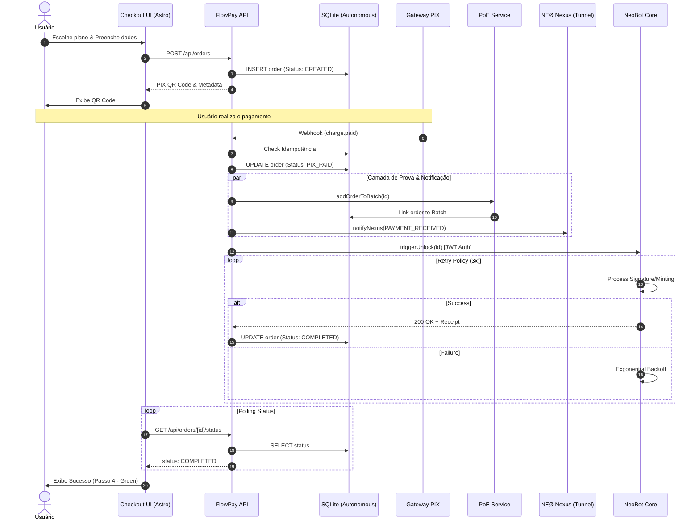
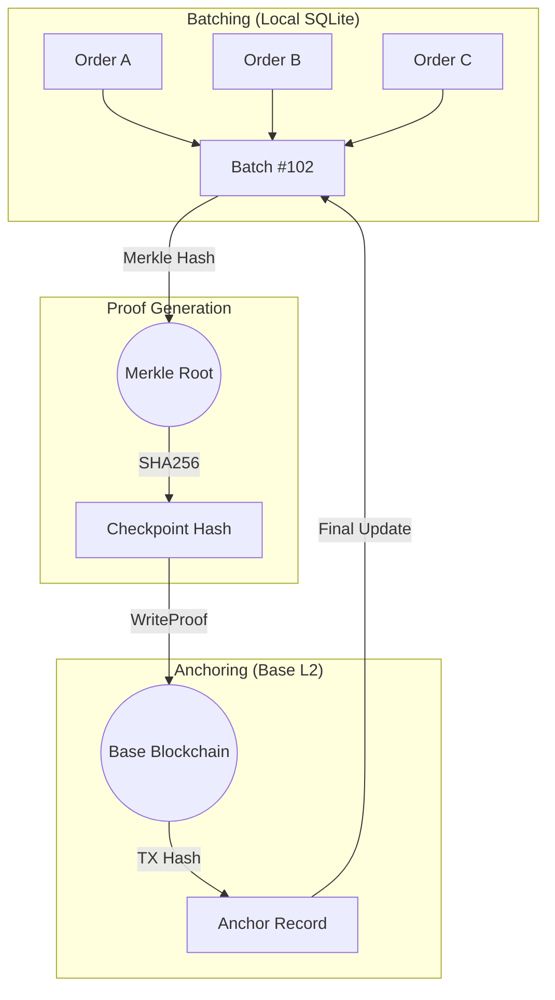
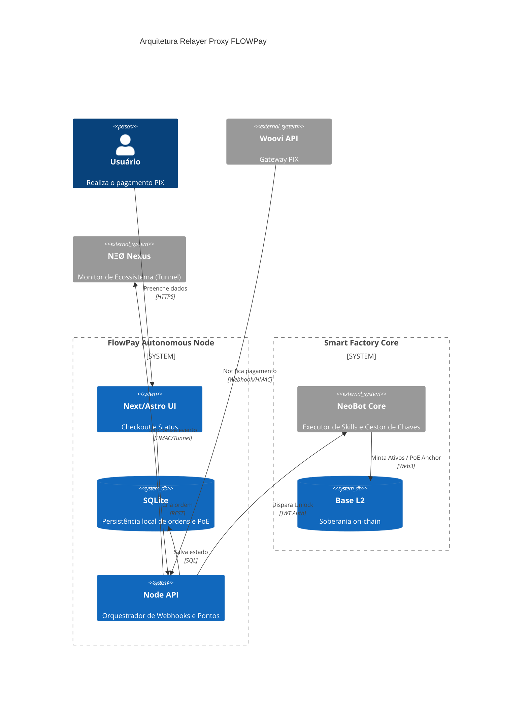
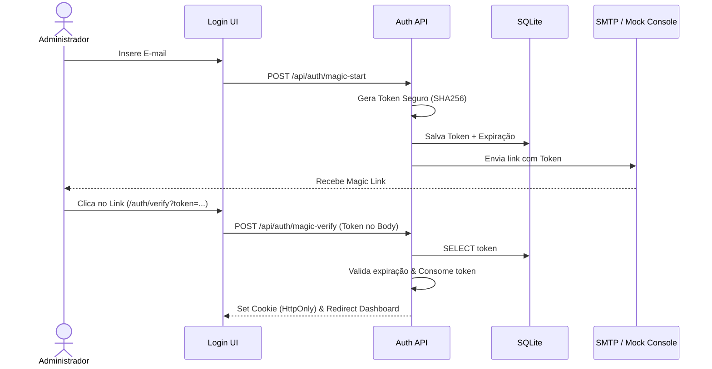

# 💳 Arquitetura de Fluxo - FLOWPay

Este documento fornece uma visão técnica aprofundada dos motores que alimentam o FLOWPay, incluindo o ciclo de vida do pagamento, a camada de prova (PoE) e as integrações de ponte.

## 1. Ciclo de Vida do Pagamento (End-to-End)

O diagrama abaixo detalha como o FLOWPay orquestra o pagamento, as notificações externas e o desbloqueio de acesso.

## 2. Camada de Prova (Proof-of-Execution - PoE)

O FLOWPay não apenas processa o pagamento, mas cria uma trilha de auditoria Merkle que é ancorada na Base L2.

## 3. Arquitetura Relayer Proxy

O FLOWPay atua como um coordenador de intenções, mantendo a segurança pela segregação de chaves.

## 4. Fluxo de Autenticação Soberana (Magic Link)

O FLOWPay utiliza um sistema de login sem senha para garantir que apenas o dono do e-mail/wallet tenha acesso ao dashboard.

## 5. Glossário de Tecnologias

*   **PoE (Proof-of-Execution)**: Motor que agrupa ordens em lotes Merkle para provar que a execução ocorreu sem expor dados sensíveis.
*   **Nexus Bridge**: Canal de comunicação seguro que integra o FlowPay ao ecossistema NEØ para monitoramento global.
*   **Merkle Batching**: Técnica criptográfica para reduzir custos de gás e aumentar a auditabilidade das transações locais.
*   **Base L2**: Blockchain de baixa latência utilizada para ancorar as provas de execução.
