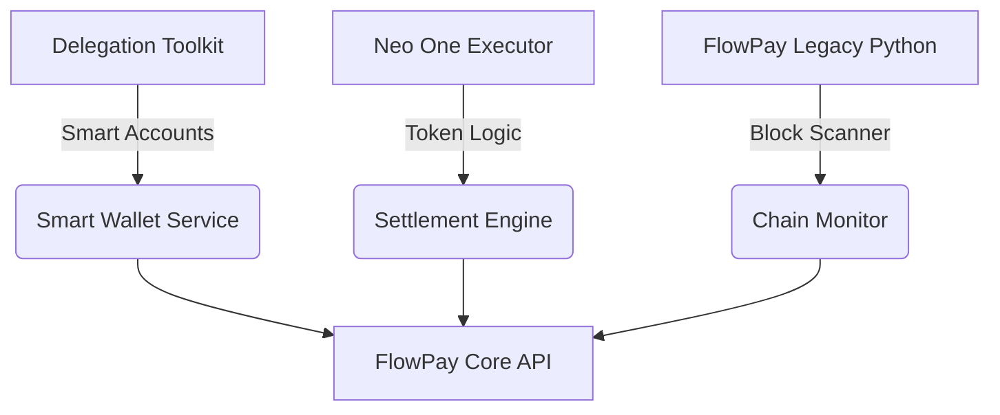

# 🏗️ TÉCNICO: Arquitetura de Migração & Integração

**Status:** RASCUNHO
**Versão:** 1.0.0
**Contexto:** Consolidação de ativos técnicos para o FlowPay Autonomous Node.

---

## 1. Visão Geral da Integração

O objetivo é fundir três fluxos técnicos distintos em um único motor financeiro coeso dentro do FlowPay (Astro/Node).



## 2. Detalhamento Técnico

### 2.1. Smart Wallet Service (Account Abstraction)

* **Lib:** `@metamask/smart-accounts-kit` (já presente no toolkit).
* **Padrão:** ERC-4337 (provavelmente via Infura Bundler).
* **Fluxo:**
    1. Usuário acessa -> Gera `Salt` baseado no ID do usuário.
    2. `createSmartAccount(salt)` -> Retorna endereço determinístico (Counterfactual).
    3. A conta só é deployada na primeira transação (economiza gas).

### 2.2. Settlement Engine (Tokenomics)

* **Lib:** `viem` (já usada no projeto Astro).
* **Lógica:**
  * O `neoflow-executor.js` usa uma abstração simples. No FlowPay, usaremos `viem` diretamente para instanciar os contratos.
  * **Snippet Crítico:** A lógica de `gasless: true` deve ser mapeada para `UserOperations` do Bundler, não apenas meta-transações antigas.

### 2.3.Chain Monitor (Processamento Assíncrono)

* **Desafio:**
Node.js é single-threaded. O loop de scan de blocos (do Python) pode bloquear o Event Loop se não for cuidadoso.
* **Solução:**
* Usar `BullMQ` (Redis) ou tarefas agendadas (Cron) para rodar o scanner a cada X segundos.
  * Não rodar no thread principal de renderização do Astro.
  * Usar `eth_getLogs` com filtro indexado (tópicos) para performance, ao invés de iterar transação por transação.

## 3. Mapeamento de Arquivos

| Origem (Legado) | Função Chave | Destino Proposto (FlowPay) | Observação |
| :--- | :--- | :--- | :--- |
| `integrate-token-smart-accounts.ts` | `toMetaMaskSmartAccount` | `services/wallet/factory.ts` | Adaptar para TypeScript estrito |
| `neoflow-executor.js` | `transfer` | `services/settlement/transfer.ts` | Atualizar para Viem |
| `crypto.py` | `check_erc20_token_payment` | `services/monitor/scanner.ts` | Converter logic Python -> TS |

## 4. Variáveis de Ambiente Necessárias

(Adicionar ao `.env` do FlowPay)

```env
# Smart Accounts
BUNDLER_URL=https://...
INFURA_API_KEY=...

# Settlement
OPERATOR_PRIVATE_KEY=... (Cuidado com segurança!)

# Monitor
USDT_CONTRACT_ADDRESS=...
USDC_CONTRACT_ADDRESS=...
```

---

## 5. Próximos Passos (Imediato)

1. Instalar dependências no FlowPay:
    `pnpm install @metamask/smart-accounts-kit viem`
2. Criar os arquivos de serviço vazios (`services/wallet/`, `services/settlement/`).
3. Copiar e refatorar o código conforme mapeamento acima.
